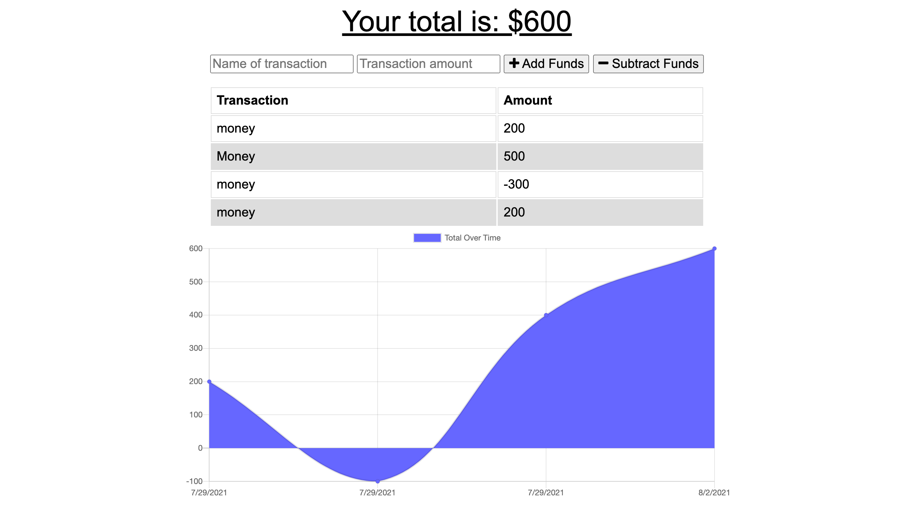

# Budget Tracker

  <a href="https://opensource.org/licenses/MIT" alt="License">
        </a>
  
  ## Description
Budget Tracker application that allows for adding expenses and deposits with or without an internet connection. This app uses a Mongo database with a Mongoose schema and handles routes with Express. It contains both a web manifest and service worker allowing for continued use after an internet outtage or on airplane mode. 

  ## Table of Contents
  - [Installation](#installation)
  - [Usage](#usage)
  - [License](#license)
  - [Contributing](#Contributing)
  - [Tests](Test)
  - [Questions](Questions)

  ## Installation
  To install necessary dependencies, run the following command:
   ``` md
   npm i
   ```
  ## Usage
  A link to the deployed application can be found [here](https://guarded-anchorage-24329.herokuapp.com/).



  ## License
  This project is licensed under the [MIT](https://opensource.org/licenses/MIT) license.

  ## Contributing
  Please feel free to contact me! See my email and GitHub username below.

  ## Tests
  To run tests, run the following command:

  ``` md
  npm test
  ```
  ## Questions
  If you have any questions about the repo, open an issue or contact me directly at <sconwell.dev@gmail.com>. You can find more of my work at [shaneconwell](https://github.com/shaneconwell).
